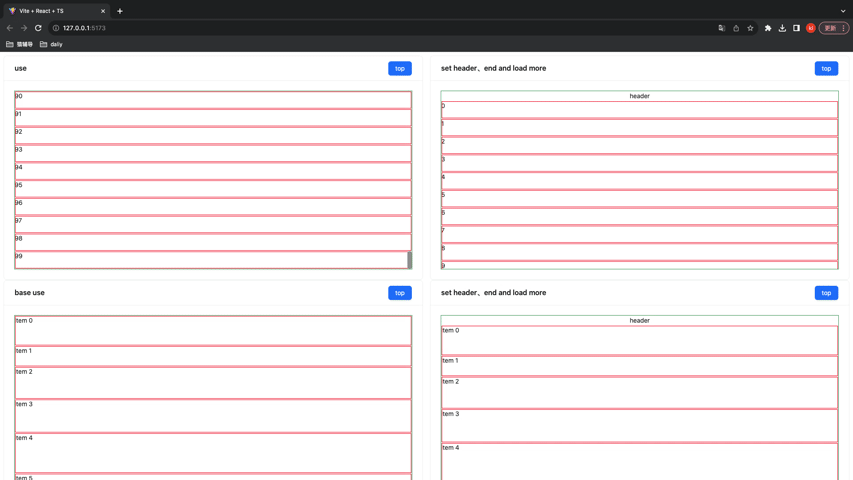
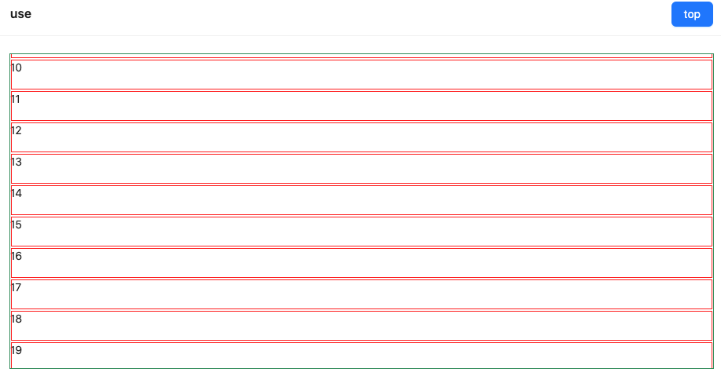
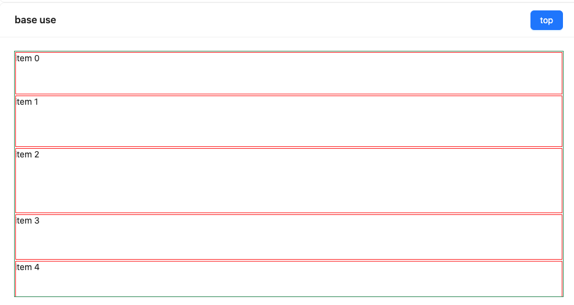
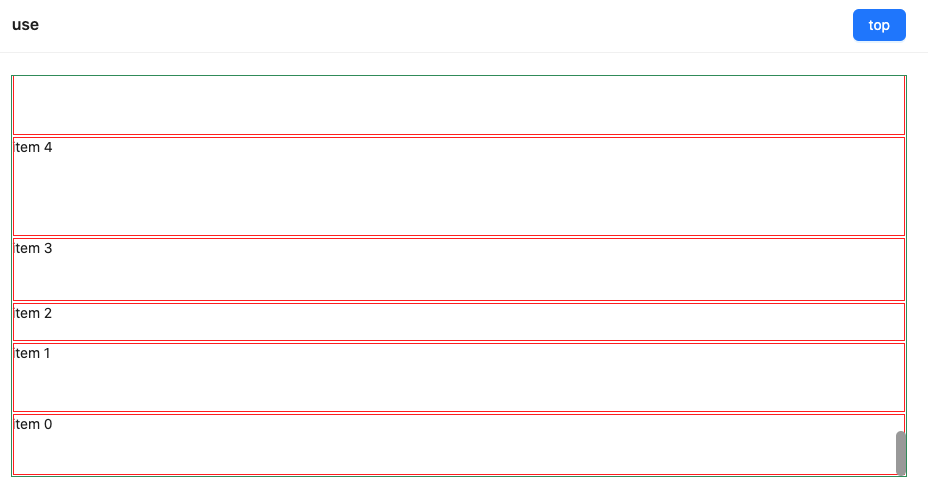

## vue-auto-list

use for vue2

[react-auto-list](https://www.npmjs.com/package/wang-rc-virtual-list)

## fixed height

## auto size height

## auto reverse size height

you can see example demo
